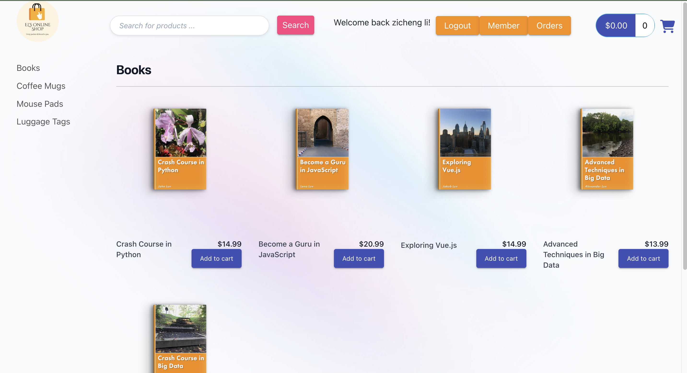

# EL's Online Shop - Frontend

This repository contains the frontend code for EL's Online Shop, a dynamic e-commerce platform developed using Angular 16.

## Backend Repository: [Spring-ecommerce-backend](https://github.com/Zicheng-Li/Spring-ecommerce-backend)

## Features: [Link to Demo Video](https://youtu.be/q0_N9ydf67c)



- **Dynamic UI/UX:** Built with Angular 16 and enhanced with Bootstrap, Tailwind, PrimeNG, and Angular Material for a responsive and interactive user interface.
  
- **User Authentication:** Integrated with Okta's Auth0 for secure user login and registration.
  
- **Shopping Cart Management:** Users can add products to their cart, view cart contents, and proceed to checkout.

## Prerequisites

- Node.js and npm
- Angular CLI

## Installation

1. Clone this repository.
2. Navigate to the project directory.
3. Create a new environment.ts file and configurate your api and key for stripe and auth0.
   
   ```typescript
   export const environment = {
     production: false,
     myApiUrl: 'http://localhost:8443/api',
     stripePublishableKey: 'YOUR_KEY',
     auth: {
       domain: 'YOUR_DOMAIN',
       clientId: 'YOUR_ID'
     }
   };
4. Run `npm install` to install the required dependencies.
5. Run `npm start` to start the development server and also make sure SpringBoot backend is running.
6. Open your browser and navigate to `http://localhost:4200/`.

## Contributing

Pull requests are welcome. For major changes, please open an issue first to discuss what you would like to change.

## License

[MIT](https://choosealicense.com/licenses/mit/)

